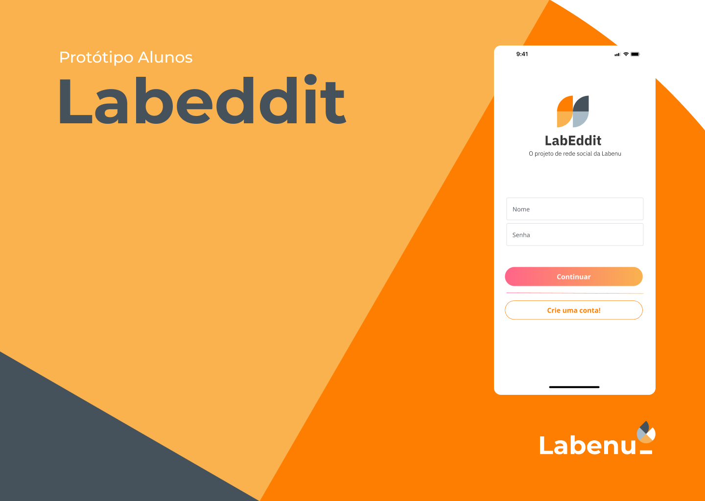
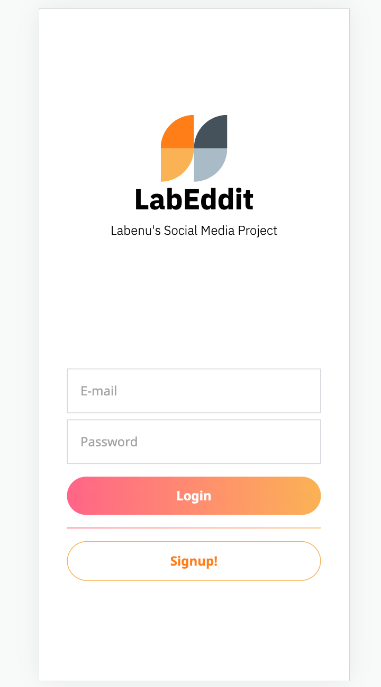
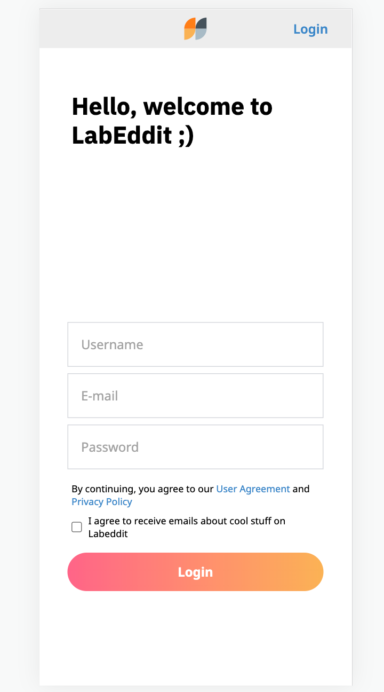
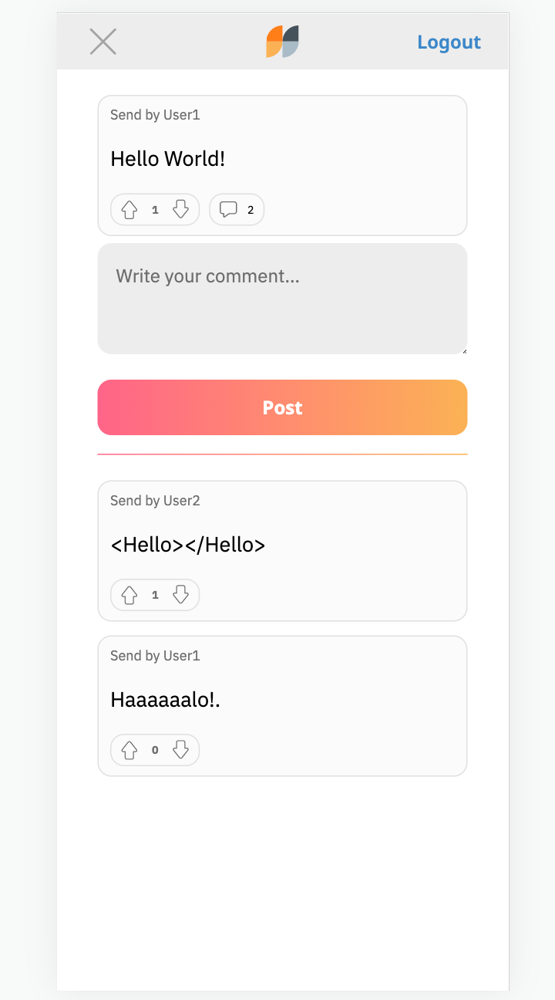

# Projeto Labeddit-Frontend



Este projeto marca a conclusão do bootcamp de desenvolvedor FullStack da Labenu, representando a síntese de todo o conhecimento que adquiri até agora, abrangendo tanto o desenvolvimento front-end quanto o back-end.

Labeddit é uma plataforma de rede social que nasceu da nossa aspiração de promover conexões significativas e interações autênticas entre as pessoas. Aqueles que se inscreverem no aplicativo terão a oportunidade de criar postagens, expressar suas opiniões com curtidas ou descurtidas, e compartilhar suas perspectivas por meio de comentários.

Este projeto foi construído a partir do zero, incluindo a criação das páginas de Login, Cadastro, Feed e Comentários de Posts. Além disso, para alimentar a plataforma, desenvolvemos nossa própria API personalizada, exclusivamente para este projeto.

🚩 [Projeto Labeddit - Backend](https://github.com/henriquediasper-dev/Labeddit-Backend)

## Funcionalidades do projeto

- Login Page
- Signup Page
- Feed Page
- Post's comments Page

## Layout

<div class="fex">




</div>

## Link Labeddit

https://henriquediasper-labeddit-project-fullstack.surge.sh/

## Comandos de instalação do projeto

```bash
# Clone this repository
$ git clone linkrepo

# Acesse the folder in you terminal
$ cd labeddit-fullstack-project-frontend

# Install dependêncies
$ npm install

# Execute the application
$ npm run dev
```

## Tecnologias abordadas

1. [React](https://pt-br.reactjs.org/)
2. [React Router](https://reactrouter.com/en/main)
3. [Tailwind](https://tailwindcss.com/)
4. [Global Context](https://pt-br.reactjs.org/docs/context.html)
5. [Axios](https://axios-http.com/docs/intro)

## Sobre o criador

[Linkedin](https://www.linkedin.com/in/henrique-diasper)
